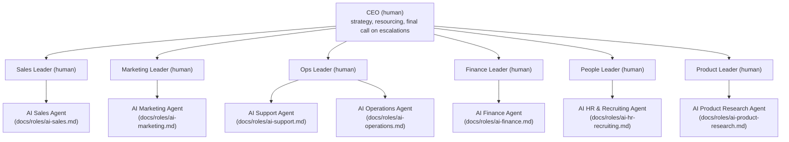

# Org Chart

## Structure

Human leadership sits at the top of each function and owns strategy, exceptions, and the
agent's KPIs. The AI seat sits under that human and owns execution of the defined mandate.
This mirrors a normal org chart — the difference is that most "individual contributor"
seats are filled by an agent instead of a hire.

## Reporting rhythm

- **Daily** — each AI seat posts a status digest to its human lead: what it did, what it
  escalated, what's queued. No meeting required to read it.
- **Weekly** — human leads review the KPI set for their AI seats (`docs/05-metrics-dashboard.md`)
  and adjust SOPs or scope as needed.
- **Monthly** — CEO reviews the autonomy tier of each AI seat and approves/denies any
  tier promotions per `docs/06-implementation-roadmap.md`.

## Seat inventory

| Seat | Owner (human) | AI seat | Mandate (one line) |
|---|---|---|---|
| Sales | Sales Leader | AI Sales Agent | Turn ICP leads into booked, qualified meetings |
| Marketing | Marketing Leader | AI Marketing Agent | Produce and distribute content that generates pipeline |
| Support | Ops Leader | AI Support Agent | Resolve customer tickets to first-contact resolution |
| Operations | Ops Leader | AI Operations Agent | Keep internal processes running without manual chasing |
| Finance | Finance Leader | AI Finance Agent | Accurate books, on-time invoicing/collections, cash visibility |
| People | People Leader | AI HR & Recruiting Agent | Source and screen candidates, run onboarding logistics |
| Product | Product Leader | AI Product Research Agent | Turn customer signal into prioritized product insight |

## What stays human-only

- Setting strategy, budget, and headcount.
- Final approval on anything in the "Human sign-off required" tier
  (`docs/03-governance-and-escalation.md`).
- Hiring/firing decisions for both human and AI seats (i.e., deciding whether an AI
  agent keeps its mandate at all).
- Relationship-critical conversations: key accounts, press, legal disputes.
